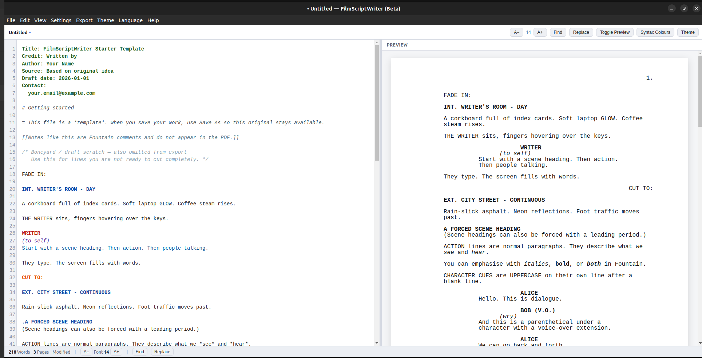

# FilmScriptWriter

> **⚠️ BETA SOFTWARE** — early preview for testing. Not a finished product.  
> Features may change or break. See [BETA.md](./BETA.md).

**FilmScriptWriter** is a cross-platform desktop screenplay editor for the [Fountain](https://fountain.io/) format. Built with **Electron**, **TypeScript**, **CodeMirror 6**, and **electron-builder**.


**Repository:** https://github.com/grahaminman/FilmScriptWriter



## Features (v1.0.1 beta)

| Feature | Description |
|--------|-------------|
| **Projects** | First-run asks for a base folder; each screenplay lives in `{base}/{Name}/` |
| **Draft names** | Current draft is `{Name}-draft-YYYY-MM-DD.fountain` (newest date wins) |
| **New-project template** | Edit or replace the starter Fountain file in Settings; revert to the factory copy |
| **Supporting files** | Notes and research as `.md`; PDFs and older drafts open as tabs |
| **Tabs + split** | Work on more than one file; up to 3 panes side by side |
| **Preview** | Paginated preview only for the current draft, always on the right |
| **Fountain help** | Swap the right pane for a full syntax reference; retractable index of every element |
| **Syntax coach** | Retractable bar under the toolbar follows what you type (notes, boneyard, scenes…) |
| **Notes sidebar** | `[[ Note 1]]` in the script → `# note 1` in an editable sidebar (`Notes-{title}.md`) |
| **Index** | Expandable left index: files, scenes, characters, notes (search + filter) |
| **Autosave** | Default every 5 minutes; change or turn off in Settings |
| **Spell check** | Chromium Hunspell, default British English; optional US English and Latin American / Paraguay Spanish. Dictionaries download to a local folder for offline use |
| **Help** | Searchable in-app instructions (Help → Help and Instructions, Ctrl/Cmd+/) |
| **Fountain editor** | CodeMirror 6 with full Fountain syntax highlighting |
| **Export** | Fountain, Final Draft XML (`.fdx`), and Hollywood-paginated PDF |
| **Themes / i18n** | Light, Dark, System · English (UK), Spanish (Paraguay), French (France) |

## Requirements

- **Node.js** 20+ (22 recommended)
- **npm** 10+
- Platform-specific tools only needed when *building* installers for that OS:
  - Windows: build on Windows (or use a CI runner) for `.exe`
  - macOS: build on macOS for signed `.dmg` (unsigned DMG can be produced on macOS)
  - Linux: build on Linux for `.AppImage` / `.deb`

> Cross-compilation note: `electron-builder` generally produces installers for the host OS. Use CI (GitHub Actions) or the matching OS to build each target.

## Branches

| Branch | Use for |
|--------|---------|
| `main` | Default branch — **v1.0.1** beta (merged from the development line) |
| **`v1.0.1`** | Active development — package version `1.0.1` |
| `next` | Optional sandbox for larger experiments |

## Downloads (beta)

Still **beta**. Prefer the latest tag; keep an older build if you need to roll back.

**Latest — v1.0.1:** https://github.com/grahaminman/FilmScriptWriter/releases/tag/v1.0.1

| Platform | Asset |
|----------|--------|
| Windows | `FilmScriptWriter-1.0.1-Setup.exe` |
| macOS | `FilmScriptWriter-1.0.1-x64.dmg` / `FilmScriptWriter-1.0.1-arm64.dmg` |
| Linux | `FilmScriptWriter-1.0.1.AppImage` / `FilmScriptWriter-1.0.1.deb` |

**Previous — v1.0.0.0** (kept available): https://github.com/grahaminman/FilmScriptWriter/releases/tag/v1.0.0.0

| Platform | Asset |
|----------|--------|
| Windows | `FilmScriptWriter-1.0.0-Setup.exe` |
| macOS | `FilmScriptWriter-1.0.0-x64.dmg` / `FilmScriptWriter-1.0.0-arm64.dmg` |
| Linux | `FilmScriptWriter-1.0.0.AppImage` / `FilmScriptWriter-1.0.0.deb` |

All pre-releases: https://github.com/grahaminman/FilmScriptWriter/releases

## CI installers (Windows / macOS / Linux)

You do not need your own Mac or Windows machine to **produce** installers.

1. Push to GitHub (this repo)
2. Open **Actions** → **Build installers (beta)** → **Run workflow**
3. Optionally enable **create_release** and set a **new** tag (e.g. `v1.0.1`) — older tags stay published
4. Download artifacts from the run, or from the GitHub Release page

Or push a version tag: `git tag v1.0.1 && git push origin v1.0.1`

## Quick start

```bash
# Clone
git clone https://github.com/grahaminman/FilmScriptWriter.git
cd FilmScriptWriter

# Install dependencies
npm install

# Run in development (hot reload)
npm run dev
```

## Exact commands

### Install dependencies

```bash
npm install
```

### Run in development

```bash
npm run dev
```

### Run unit tests

```bash
npm test
```

Watch mode:

```bash
npm run test:watch
```

### Typecheck

```bash
npm run typecheck
```

### Build the app (compile only, no installers)

```bash
npm run build
```

### Package installers

Build for the **current platform** (all configured targets for that OS):

```bash
npm run dist
```

Platform-specific scripts:

```bash
# Windows NSIS installer (.exe)
npm run dist:win

# macOS disk image (.dmg)
npm run dist:mac

# Linux AppImage + deb
npm run dist:linux

# Attempt all targets (requires appropriate host / tooling)
npm run dist:all
```

Unpackaged directory build (faster smoke test):

```bash
npm run pack
```

Installers are written to the `release/` directory.

| Platform | Artifact |
|----------|----------|
| Windows  | `FilmScriptWriter-<version>-Setup.exe` |
| macOS    | `FilmScriptWriter-<version>-<arch>.dmg` |
| Linux    | `FilmScriptWriter-<version>.AppImage` and `.deb` |

## Project structure

```
GrokCodeTest/
├── build/                  # electron-builder resources (icons)
├── resources/              # Extra runtime assets
├── src/
│   ├── main/               # Electron main process
│   │   ├── index.ts        # App entry, window lifecycle
│   │   ├── menu.ts         # Native menu bar
│   │   ├── ipc.ts          # IPC handlers
│   │   ├── file-service.ts # Open / save / export
│   │   ├── store.ts        # Persistent preferences
│   │   └── auto-updater.ts # electron-updater integration
│   ├── preload/            # contextBridge API
│   ├── renderer/           # UI (Vite)
│   │   ├── editor/         # CodeMirror + Fountain language
│   │   ├── preview/        # Live paginated preview
│   │   ├── styles/
│   │   ├── main.ts
│   │   └── index.html
│   └── shared/             # Pure logic (testable)
│       ├── constants/      # Margins, IPC names, locales
│       ├── fountain/       # Parser, characters, pagination
│       ├── export/         # Fountain / FDX / PDF
│       └── i18n/           # en_GB, es_PY, fr_FR
├── tests/                  # Vitest unit tests
├── electron.vite.config.ts
├── package.json
└── README.md
```

## Fountain syntax fidelity

Preview and PDF aim to follow [fountain.io/syntax](https://fountain.io/syntax) (Fountain 1.1): emphasis, dual dialogue, forced `@` names, notes, boneyard, etc. See [docs/FOUNTAIN-FIDELITY.md](./docs/FOUNTAIN-FIDELITY.md) for the full matrix and known limits.

**Find / replace:** patterns like `#*#` use simple wildcards (`*` = any text) so scene numbers `#1#`, `#2#` can be removed in one pass.

## Starter template

On first launch (and whenever **File → New** is used), FilmScriptWriter loads a built-in starter template that demonstrates Fountain screenplay syntax and outline/markdown-style extras (`#` sections, notes, boneyard, dual dialogue, etc.).

| Location | Purpose |
|----------|---------|
| `resources/templates/FilmScriptWriter-Starter.fountain` | Bundled with the app (packaged into installers) |
| `templates/FilmScriptWriter-Starter.fountain` | Copy in the project repo for browsing / version control |
| `Documents/FilmScriptWriter/templates/FilmScriptWriter-Starter.fountain` | User-visible copy installed on first run |

**Settings → Projects, Autosave and Template** lets you edit that starter, replace it with your own `.fountain` file, or revert to a kept factory copy. New projects copy the current user template (and stamp the project title). The same dialog (and **Settings → Spell check**) turns the live spell checker on or off, chooses **English (UK)**, **English (US)** and **Spanish (Latin America / Paraguay)**, and downloads Hunspell dictionaries into a local folder so checking still works offline. You can also point the download URL at a self-hosted copy of the `.bdic` files.

**The factory template is never overwritten by Save.** Loading it as a document always opens an *untitled* buffer. Use **Save As** to create your own screenplay.

On subsequent launches, the app reopens the **last project or file** (if it still exists).

## Fountain syntax (cheat sheet)

| Element | How to write it |
|---------|-----------------|
| Scene heading | `INT. LOCATION - DAY` or force with `.LIKE THIS` |
| Action | Normal paragraphs |
| Character | `NAME` in ALL CAPS on its own line (after a blank line) |
| Parenthetical | `(wryly)` under a character |
| Dialogue | Lines under character / parenthetical |
| Transition | `CUT TO:` or `>FADE OUT` |
| Centered | `>THE END<` |
| Page break | `===` |
| Notes | `[[note text]]` |
| Boneyard | `/* ignored */` |

## Hollywood pagination

PDF export and the live preview share one layout engine (`src/shared/fountain/page-counter.ts` + `src/shared/export/pdf.ts`):

- US Letter (8.5" × 11")
- Courier 12 pt, ~12 pt leading
- Margins: left 1.5", right 1", top/bottom 1"
- Character / parenthetical / dialogue indents match Final Draft defaults
- Status bar page count uses the same algorithm

## Preferences

Stored with `electron-store` in the user data directory:

- Theme (`light` | `dark` | `system`)
- Locale (`en_GB` | `es_PY` | `fr_FR`)
- Last open/save directory and last project
- Projects base folder and autosave interval
- Preview / Fountain help pane, index, notes, syntax coach
- Window bounds

## Auto-update

Packaged builds use `electron-updater` with the `publish` block in `package.json` (GitHub Releases). Update the `build.publish.owner` / `repo` fields to your repository. In development, **Help → Check for Updates** reports that updates apply only to packaged releases.

## Scripts reference

| Script | Purpose |
|--------|---------|
| `npm run dev` | Development with hot reload |
| `npm run build` | Compile main / preload / renderer |
| `npm test` | Run Vitest unit tests once |
| `npm run test:watch` | Vitest watch mode |
| `npm run typecheck` | TypeScript project references check |
| `npm run pack` | Build + electron-builder `--dir` |
| `npm run dist` | Build + installers for host platform |
| `npm run dist:win` | Windows installer |
| `npm run dist:mac` | macOS DMG |
| `npm run dist:linux` | Linux AppImage + deb |
| `npm run dist:all` | All platform targets |

## Development notes

- **Security**: `contextIsolation: true`, no Node integration in the renderer; all filesystem access goes through the preload bridge.
- **Tests**: Pure shared modules (parser, characters, pagination, FDX/Fountain export) are covered by Vitest. PDF generation is exercised via the export path in the main process.
- **Comments**: Non-obvious layout constants, Fountain edge cases, and IPC contracts are documented in-source.

## Keyboard shortcuts

| Shortcut | Action |
|----------|--------|
| `Ctrl/Cmd+N` | New project |
| `Ctrl/Cmd+Shift+N` | New untitled |
| `Ctrl/Cmd+O` | Open file |
| `Ctrl/Cmd+Shift+O` | Open project |
| `Ctrl/Cmd+S` | Save |
| `Ctrl/Cmd+Shift+S` | Save As |
| `Ctrl/Cmd+Z` / `Ctrl/Cmd+Shift+Z` | Undo / Redo |
| `Ctrl/Cmd+F` | Find |
| `Ctrl/Cmd+P` | Toggle preview |
| `Ctrl/Cmd+Shift+P` | Fountain syntax help |
| `Ctrl/Cmd+/` | Searchable help |
| `Ctrl/Cmd+1` / `2` / `3` | One / two / three panes |

## License

MIT — see [LICENSE](./LICENSE).
